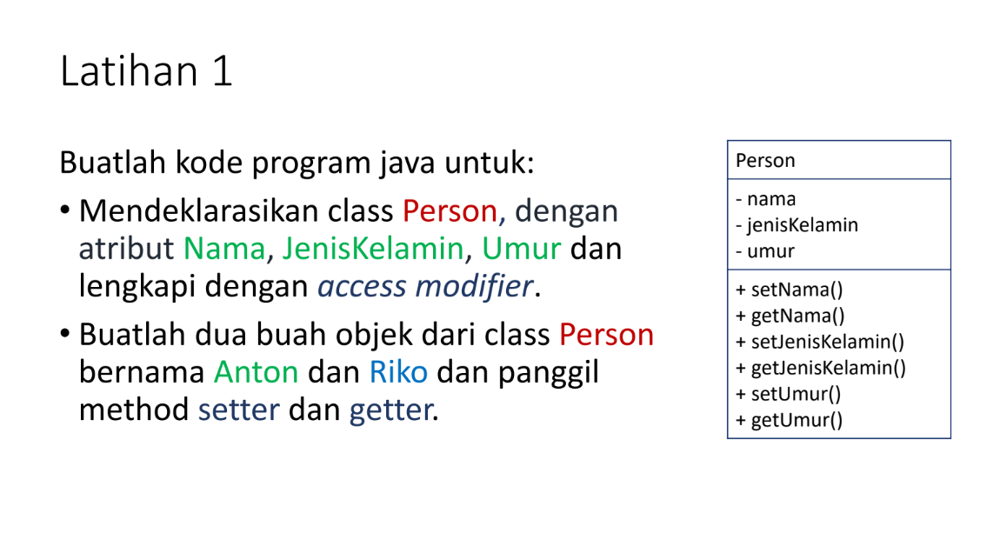
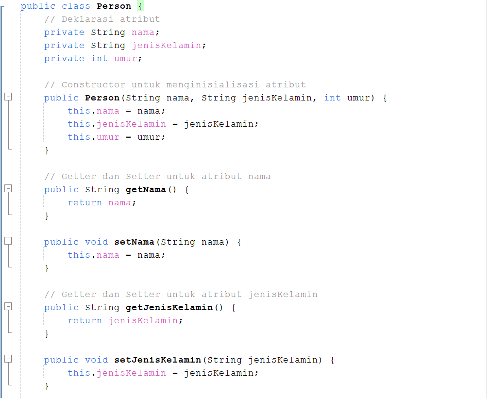
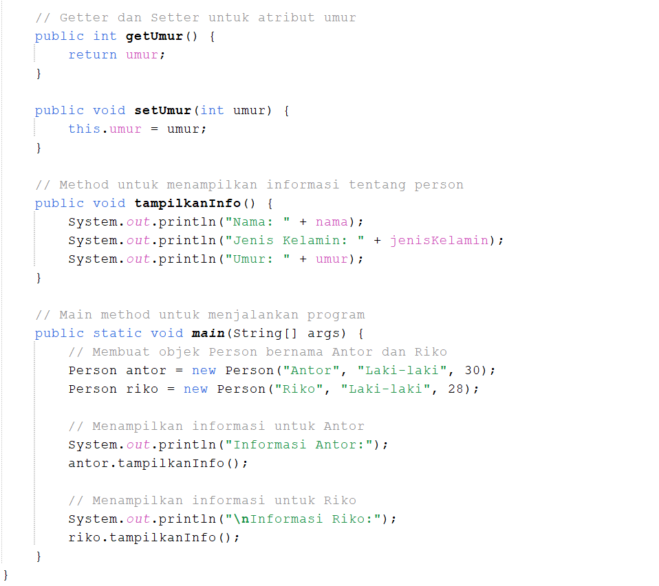
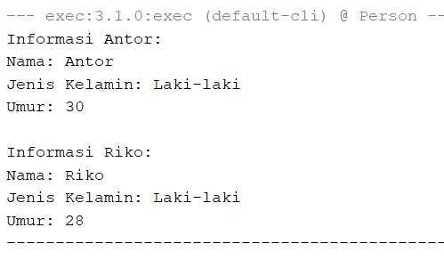

Nama: Laras Sakti
NIM: 312310627  
Kelas: TI.23.A6   

# Praktikum2

## Laporan Praktikum

- Buat repository Praktikum2
- Buat penjelasan program beserta screenshot hasil eksekusiprogram pada file README.md
- Simpan semua perubahan dan push ke repository github
- Submit URL Repository Github pada kolom tugas di eCampus.

## Jawaban
## * Mendeklarasikan class person dengan dilengkapi access modifier
# *Access Modifier private pada atribut nama, jenis kelamin, umur

// Deklarasi atribut
    private String nama;
    private String jenisKelamin;
    private int umur;
• Atribut nama, jenisKelamin, dan umur menggunakan access modifier ` private `. Berarti atribut tersebut hanya dapat di akses oleh kelas itu saja yaitu class person    

# *Access Modifier public pada class Person, constructor Person, semua getter dan setter, method tampilkanInfo, dan method main
public class Person {
// Constructor untuk menginisialisasi atribut
    public Person(String nama, String jenisKelamin, int umur) {
        this.nama = nama;
        this.jenisKelamin = jenisKelamin;
        this.umur = umur;
    }

    // Getter dan Setter untuk atribut nama
    public String getNama() {
        return nama;
    }

    public void setNama(String nama) {
        this.nama = nama;
    }

    // Getter dan Setter untuk atribut jenisKelamin
    public String getJenisKelamin() {
        return jenisKelamin;
    }

    public void setJenisKelamin(String jenisKelamin) {
        this.jenisKelamin = jenisKelamin;
    }

    // Getter dan Setter untuk atribut umur
    public int getUmur() {
        return umur;
    }

    public void setUmur(int umur) {
        this.umur = umur;
    }

    // Method untuk menampilkan informasi tentang person
    public void tampilkanInfo() {
        System.out.println("Nama: " + nama);
        System.out.println("Jenis Kelamin: " + jenisKelamin);
        System.out.println("Umur: " + umur);
    }
    
    public static void main(String[] args) {
        // Membuat objek Person bernama Antor dan Riko
        Person antor = new Person("Anton", "Laki-laki", 30);
        Person riko = new Person("Riko", "Laki-laki", 28);
- class Person, constructor Person, semua getter dan setter, method tampilkanInfo, dan method main menggunakan access modifier `public`. mereka menggunakan access modifier `public`, berarti mereka dapat dipanggil diluar kelas `person`
  
# - Membuat dua buah objek dengan memanggil metode getter dan setter        
# *Membuat dua buah objek Anton dan Riko
 // Membuat objek Person bernama Antor dan Riko
        Person antor = new Person("Anton", "Laki-laki", 25);
        Person riko = new Person("Riko", "Laki-laki", 35);

# *Memangil metode Getter dan Setter
# Getter dan Setter untuk nama
 // Getter dan Setter untuk atribut nama
    public String getNama() {
        return nama;
    }

    public void setNama(String nama) {
        this.nama = nama;
    }
# Getter dan Setter untuk jenis kelamin
 // Getter dan Setter untuk atribut jenisKelamin
    public String getJenisKelamin() {
        return jenisKelamin;
    }

    public void setJenisKelamin(String jenisKelamin) {
        this.jenisKelamin = jenisKelamin;
    }
# Getter dan Setter untuk umur    
 // Getter dan Setter untuk atribut umur
    public int getUmur() {
        return umur;
    }

    public void setUmur(int umur) {
        this.umur = umur;
    }
• Method getter untuk (getNama, getJenisKelamin, getUmur) digunakan untuk mendapatkan informasi dari masing-masing objek (Anton dan Riko) dan menampilkannya.

• Method setter (setNama, setUmur) digunakan untuk mengubah nilai atribut nama dan umur dari objek (Anton dan Riko).

• Setelah perubahan melalui setter, maka informasi baru dari kedua objek ditampilkan menggunakan getter.

# kode Keseluruhan    
## *INPUT

## *OTPUT

## Penjelasan
Kode Java di atas mendefinisikan kelas Person yang mewakili seseorang dengan atribut nama, jenisKelamin, dan umur. Kelas ini menyediakan konstruktor untuk menginisialisasi objek Person, serta getter dan setter untuk mengakses dan memodifikasi atribut tersebut.

Ada juga metode tampilkanInfo yang menampilkan informasi tentang objek Person ke konsol. Pada method main, dua objek Person dibuat—Anton dan Riko—dan informasi mereka ditampilkan di konsol.

Berikut adalah penjelasan dari kode:

1. Deklarasi Atribut: Terdapat tiga atribut privat yaitu nama, jenisKelamin, dan umur.
2. Constructor: Konstruktor digunakan untuk menginisialisasi atribut ketika objek baru dibuat.
3. Getter dan Setter: Metode ini digunakan untuk mengakses (get) dan mengubah (set) nilai dari atribut privat.
4. tampilkanInfo(): Metode ini menampilkan detail dari objek Person.
5. Main Method: Di sini program membuat dua objek Person, yaitu Anton dan Riko, kemudian menampilkan informasi masing-masing.

